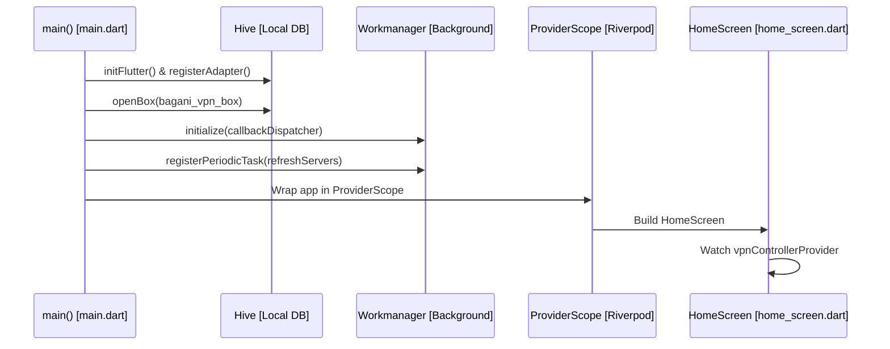
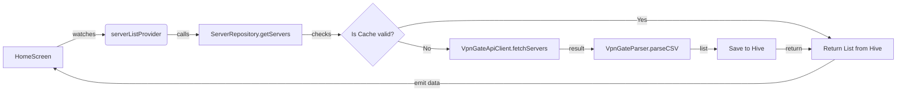
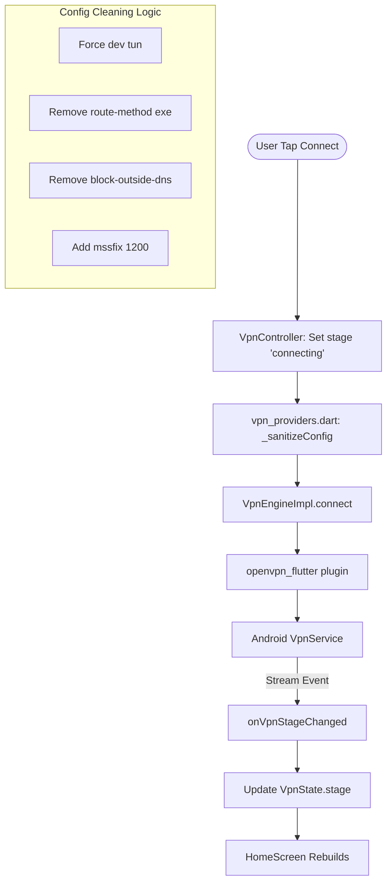
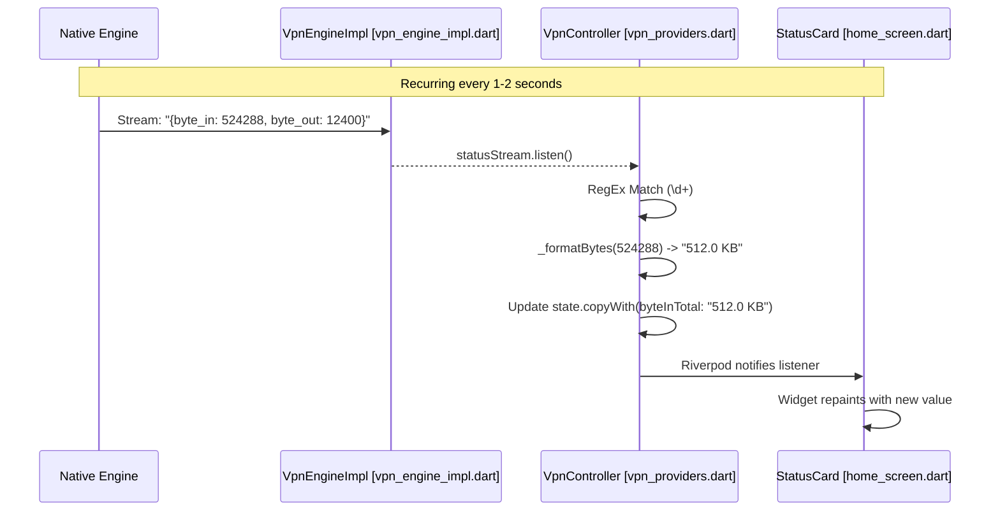

# BaganiVPN: Code Execution Flow Detail

This document provides a step-by-step visualization of how the code executes, which files are involved, and how data moves through the system.

---

## 1. Application Startup Flow

**Entry Point:** `lib/main.dart`

---

## 2. Server List Fetching Flow

**Files:** `home_screen.dart` -> `vpn_providers.dart` -> `server_repository_impl.dart` -> `vpn_gate_api_client.dart`

---

## 3. VPN Connection Lifecycle

**The "Happy Path" from button click to secure tunnel.**

1. **User Action:** User taps the connect button in `HomeScreen`.
2. **Controller Logic:** `VpnController.connect(server)` is triggered in `vpn_providers.dart`.
3. **Data Prep:** The Base64 configuration from the server is decoded and passed to `_sanitizeConfig`.

---

## 4. Real-time Statistics Loop (Powering the UI)

**How the "Download/Upload" numbers move.**

---

## 5. File Responsibilities Summary

| File Path                     | Primary Responsibility                                                  |
| :---------------------------- | :---------------------------------------------------------------------- |
| `main.dart`                   | Bootstrapping, Background task registration.                            |
| `vpn_providers.dart`          | **Core Logic**. Handles the state, cleaning configs, and parsing stats. |
| `vpn_engine_impl.dart`        | **Plugin Wrapper**. Interfaces between Dart and the OpenVPN library.    |
| `vpn_gate_api_client.dart`    | **Networking**. Raw HTTP calls to the server API.                       |
| `vpn_gate_parser.dart`        | **Data Transformation**. Turns raw CSV text into clean Dart Objects.    |
| `home_screen.dart`            | **Main UI**. Reactive display of the connection status and stats.       |
| `server_repository_impl.dart` | **Persistence**. Managing the Hive cache and offline logic.             |
